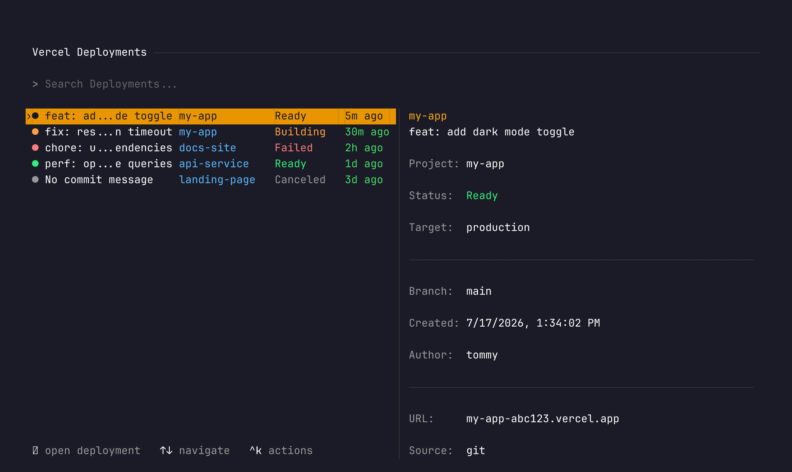
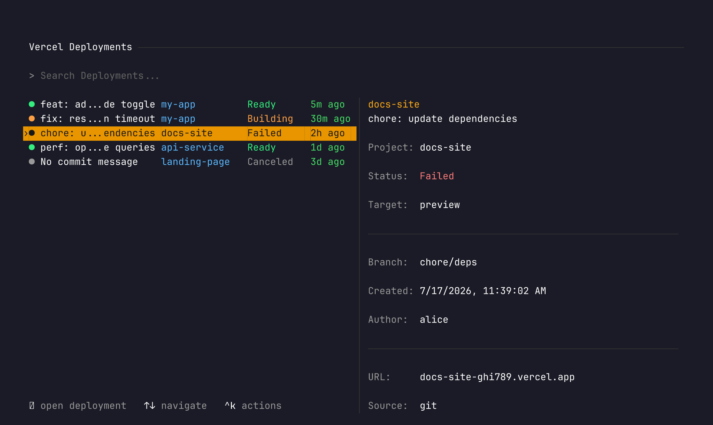
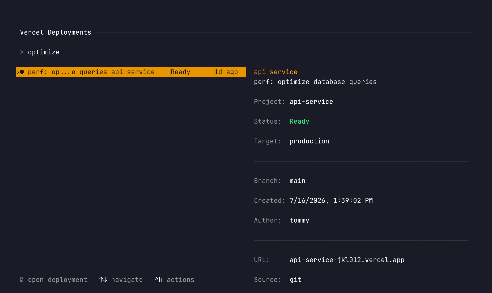

<div align='center' class='hidden'>
    <br/>
    <br/>
    <h3>verceltui</h3>
    <p>Browse your Vercel deployments from the terminal</p>
    <br/>
    <br/>
</div>

A terminal UI for viewing Vercel deployments, built with [termcast](https://github.com/remorses/termcast). Split-pane layout with a detail panel showing project metadata, status, branch, and author info.



## Install

Requires [Bun](https://bun.sh) and [termcast](https://github.com/remorses/termcast).

```bash
pnpm install -g termcast
```

Clone and run:

```bash
git clone https://github.com/remorses/verceltui
termcast dev ./verceltui
```

On first run it will ask for a **Vercel access token**. Create one at [vercel.com/account/tokens](https://vercel.com/account/tokens).

## Features

**Deployments list** with colored status indicators, project name tags, and relative timestamps. All columns are aligned across items.



**Search** filters deployments by commit message, project name, or branch.



**Detail panel** shows project name, deployment status, target environment, git branch, creation time, author, URL, and deploy source.

**Actions** (press `ctrl+k`):
- Open deployment URL in browser
- Open on Vercel dashboard
- Copy URL to clipboard
- Refresh deployments (`ctrl+r`)

**Team switching** via dropdown when you belong to multiple Vercel teams.

## Project structure

```
verceltui/
  src/
    search-deployments.tsx       # main command component
    vercel-api.tsx               # Vercel REST API client
    types.tsx                    # Deployment, Team, User types
    search-deployments-demo.tsx  # demo with mock data (for tests)
    search-deployments.vitest.tsx # e2e tests
```

## Running tests

```bash
pnpm e2e
```

Tests use [tuistory](https://github.com/remorses/tuistory) to launch the TUI with mock data and validate rendering via inline snapshots.
